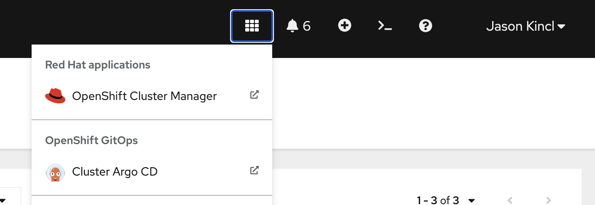

# multicloud-gitops

aka gitops for testing ODF Regional-DR

## Hub

The hub cluster needs to be configured with items in `acm-gitops/` directory.

Upstream doc: https://access.redhat.com/documentation/en-us/red_hat_advanced_cluster_management_for_kubernetes/2.6/html/applications/managing-applications#prerequisites-argo

| File | Purpose |
| ---- | ------- |
| argocd.yaml | Changes to the OpenShift GitOps cluster install of Argo CD |
| gitopscluster.yaml, placement.yaml | Sets up the link between ACM and openshift-gitops |

Once the links are made, ACM will populate the clusters based on the placement rule in the Argo CD instance in the openshift-gitops namespace.

## ApplicationSet

ApplicationSets are from Argo CD and are used to template out Applications which deploy manifests to a Kubernetes cluster.

The web interface for the Cluster Argo CD can be accessed from the top ribbon of the OpenShift Console:

The ApplicationSets are in the `applications/` directory.

| File | Purpose |
| ---- | ------- |
| placement.yaml | Describes the custom resources that are used by the ApplicationSet to get a list of clusters to create Applications from it's template |
| cert-manager.yaml | Deploys cert-manager with upstream Helm chart (needed because we need v1.9.1) from `cert-manager/` |
| cluster-certificates.yaml | Uses cert-manager to get signed certificates for cluster default ingress controller from `cluster-certificates/` |
| odf-operator.yaml | Deploys ODF from `odf/` |

## cert-manager

I had to use the upstream helm chart instead of our openshift-cert-manager-operator because I needed access to a feature released in v1.9.1 which lets us use a secret object reference for the AWS Key ID in the ClusterIssuer which we needed because we are using the cluster-credential-operator to build a IAM role for cert-manager to do DNS-based ACME with LetsEncrypt

The cert-manager deployment has some options to deal with the split-horizon DNS that is implemented in our OpenShift AWS deployment, detail: https://github.com/cert-manager/cert-manager/issues/1627

## ODF

Works really well, I used this KCS article to put together the resources: https://access.redhat.com/articles/5683981

Upstream doc: https://access.redhat.com/documentation/en-us/red_hat_openshift_data_foundation/4.11/html-single/deploying_openshift_data_foundation_using_amazon_web_services/index#deploy-using-dynamic-storage-devices-aws